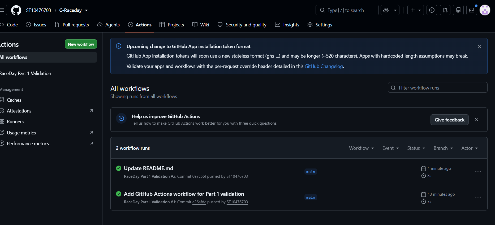

# RaceDay

## South African Road Running, Walking and Cycling Event Management System

RaceDay is a full-stack web-based event management system designed for the South African road running, walking and cycling community.

The system is designed to provide a central platform where Event Organisers can create and manage sporting events while Participants can discover events, enrol in available categories and track their race history.

The project is being developed progressively across three parts:

1. **Part 1 – System Planning and Database**
2. **Part 2 – RESTful API Development**
3. **Part 3 – MVC Web Application, Azure Blob Storage and Docker**

---

# Part 1 – System Planning and Database

Part 1 focuses on planning the RaceDay system before application development begins.

The Part 1 deliverables include:

- Entity Relationship Diagram (ERD)
- RESTful API Endpoint Plan
- SQL Server database script
- Sample database data
- GitHub version control
- GitHub Actions CI/CD validation

All Part 1 planning documents are stored in the `docs` folder.

---

# System Roles

RaceDay supports two main user roles.

## Organiser

Organisers are responsible for managing RaceDay events.

An Organiser can:

- Create events
- Edit events
- Delete events
- Create event categories
- Update event categories
- Delete event categories
- View participant enrolments for their events
- Capture participant results
- Update participant results
- Manage event route information
- Manage event weather information
- Upload event banner images

Organiser functionality will be protected using role-based access control.

## Participant

Participants use RaceDay to find and participate in sporting events.

A Participant can:

- Create an account
- Log in
- View and update their profile
- Browse upcoming events
- View event information
- View available categories
- Enrol in an event
- Select an event category
- View their own enrolments
- View their personal race results
- View route information
- View weather information
- Upload a profile image

Participants cannot access Organiser-only functionality.

---

# Database Design

The RaceDay database is designed for Microsoft SQL Server.

The database contains the following main entities:

- Users
- Events
- Categories
- Enrolments
- Results
- Routes
- WeatherInformation

The relationships between these entities support the main RaceDay business processes.

For example:

- One Organiser can create many Events.
- One Event can have many Categories.
- One Participant can have many Enrolments.
- An Enrolment belongs to one Event and one Category.
- An Enrolment can have one Result.
- An Event can have route information.
- An Event can have weather information.

## ERD

The Entity Relationship Diagram is located at:

`docs/RaceDay_ERD.png`

The ERD identifies the primary keys, foreign keys and relationships required by the RaceDay database.

---

# API Endpoint Plan

The planned RESTful API is documented in:

`docs/API_Endpoint_Plan.md`

The API is divided into functional areas including:

- Authentication
- User Profiles
- Events
- Categories
- Enrolments
- Results
- Route Information
- Weather Information

The API plan defines the HTTP method, route, description, required role, request body and expected response for each endpoint.

The Part 2 API will be implemented according to this plan.

---

# SQL Database Script

The SQL Server database creation and seed script is located at:

`docs/RaceDay_Database.sql`

The script contains:

- Database creation
- Table creation
- Primary keys
- Foreign keys
- Unique constraints
- Check constraints
- Default constraints
- Sample users
- Sample events
- Event categories
- Participant enrolments
- Sample results
- Route information
- Weather information
- Verification queries

The sample data includes Organisers, Participants, Events, Categories and Enrolments as required by the Part 1 specification.

---

# API Security Planning

Role-based access is planned at API level.

The API must determine:

1. Whether a user is authenticated.
2. Which role the authenticated user has.
3. Whether that role is allowed to perform the requested operation.
4. Whether an Organiser owns the event they are attempting to manage.
5. Whether a Participant is accessing their own profile, enrolments or results.

Passwords must never be stored as plain text.

Password hashing and authentication implementation will be completed during Part 2.

---

# GitHub and Version Control

GitHub is used throughout the project for source control and submission.

The repository contains the Part 1 planning documentation and will be extended during Parts 2 and 3.

Meaningful commits are used to demonstrate the development process.

The project follows the required minimum of **20 meaningful commits for Part 1**.

---

# CI/CD

GitHub Actions is used to automatically validate the Part 1 repository structure.

The workflow is located at:

`.github/workflows/part1-validation.yml`

The workflow checks that the required Part 1 files and folders are present.

## Successful CI/CD Build

The Part 1 GitHub Actions workflow has successfully completed with a green build.

<!-- Add the screenshot of the successful GitHub Actions build here -->



---

# Repository Structure

The planned repository structure is:

```text
C-Raceday/
│
├── .github/
│   └── workflows/
│       └── part1-validation.yml
│
├── docs/
│   ├── RaceDay_ERD.png
│   ├── API_Endpoint_Plan.md
│   └── RaceDay_Database.sql
│
└── README.md
